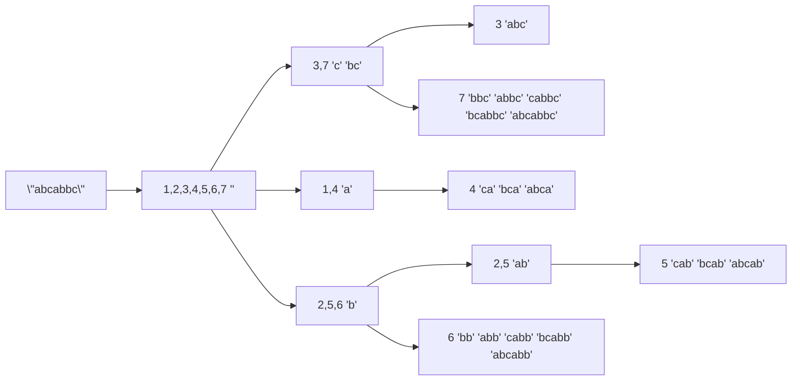
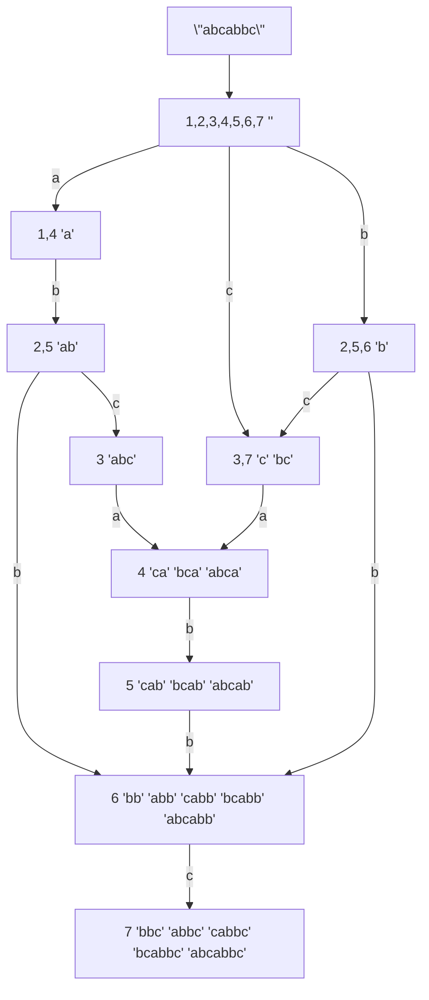

---
tags:
  - undone
  - 自动机/后缀自动机_SAM
  - 后缀数组_SA
---
## SAM

想要去判断一个串是否是另一个串 S 的的子串的话，最简单的方法就是把 S 的所有子串加入一个 trie， 然后查询，但这样子复杂度就爆到了 $O(n^2)$
这时就要用 SAM 解决
SAM 是后缀自动机，也就是从一个状态在后面加字符后转移到另一个状态，它的每一个节点都是一个 **endpos 等价类**，连边从空串到满串

>[!什么是 endpos 等价类]
>定义一个子串的 endpos 为所有可以以该子串为后缀的位置的集合，一个 endpos 等价类就是所有 endpos 相同的子串的集合
>endpos 等价类有如下性质：
>1. $u,v\in \text{endpos},|u|<|v|\iff$ u 为 v 的后缀
>2. $\text{endpos}(u)\cap\text{endpos}(v)\neq\emptyset,|u|<|v|\iff\text{endpos}(u)\subseteq\text{endpos}(v)$，u 为 v 的后缀
>3. 一个 endpos 等价类里的子串长度是连续的

观察上面的三条性质，发现性质 2 给出了 endpos 等价类之间没有重合关系，只有包含关系，这有点像线段树的结构
故可以把 endpos 等价类按照包含关系做成一颗树，叫 parent tree
例如（花了我巨久）：



而这样子分隔，节点数显然是 O(n) 的

发现 endpos 随着树向下元素数越来越少，而对应的子串越来越长
发现 父节点的子串最长长度+1=自己的最短子串的长度

而一个惊人的结论就是 **SAM 的节点就是这个树的节点**
(上面那个对应的SAM)


接下来就是该如何构造 SAM 的边和点（其实 SAM 能同时求出 parent tree）

```cpp
struct Node {
    int fa,len,chd[26];
    Node(){ms(chd,0),fa=len=0;}
} tr[2*N];
int lst=1,tot=1;
void add(int c){
    int p=lst,np=lst=++tot;
    tr[np].len=tr[p].len+1;
    for(;p&&!tr[p].chd[c];p=tr[p].fa)tr[p].chd[c]=np;
    if(!p)tr[np].fa=1; // case 1
    else {
        int q=tr[p].chd[c];
        if (tr[q].len==tr[p].len+1)tr[np].fa=q; // case 2
        else {
            int nq=++tot;tr[nq]=tr[q];
            tr[nq].len=tr[p].len+1;
            tr[q].fa=tr[np].fa=nq;
            for(;p&&tr[p].chd[c]==q;p=tr[p].fa)tr[p].chd[c]=nq; // case 3
        }
    }
}
```

但目前我真的不会解释

### 特点

SAM 是一个 DAG，但不满足 idx chd > idx self
### 可以解决的问题

>[!判断是否是子串]
>直接在 SAM 里跑一遍就行
>```cpp
>bool qry(string& s) {
>	int cur=1;
>	aFor(c,s) {
>		cur=tr[cur].chd[c-'a'];
>		if (cur == 0) return false;
>	}
>	return true;
>}
>```

>[!不同的子串个数（不含空串）]
>因为在 SAM 里的每一条路径都对应一种不同的子串，那么直接 DAG DP 即可，这里的 cnt 指的是经过该节点的路径数
>```cpp
>// 这种会多数一个空串，但符合我的定义
>int cnt[2*N];
>int difS1(int u=1) {
>    if (cnt[u]) return cnt[u];
>    cnt[u]=1;
>    For(j,0,25) if (tr[u].chd[j]) cnt[u]+=difS1(tr[u].chd[j]);
>    return cnt[u];
>}
>// 这种不会多数一个空串，但 cnt 定义里是没有空串的
>int cnt[2*N];
>int difS1(int u=1) {
>    if (cnt[u]) return cnt[u];
>    For(j,0,25) if (tr[u].chd[j]) cnt[u]+=difS1(tr[u].chd[j])+1;
>    return cnt[u];
>}
>```
>另一种想法是 parent tree 一个节点里的串的长度是连续的，而每个节点所对应的子串的不交并恰好是原串的所有子串，所以答案就是每个节点的len-父节点的len的和
>```cpp
>// 这样算也是算上没有空串的
>int difS2() {
>    int ans=0;
>    For(i,1,tot)ans+=tr[i].len-tr[tr[i].fa].len;
>    return ans;
>}
>```

>[!字典序第 k 大的子串（本质不同/不要求本质不同）]
>#### 本质不同:
>同上面的方法把经过每个节点的路径数算出来，然后从上往下贪心的走即可
>
>#### 不要求本质不同:
>和前面的想法类似，但是每个节点对 rank 的贡献变成了 cnt \* siz，

>[!求两个串的最长公共子串]
> 先咕着

## 后缀树
先丢着

可以解决：
[P3809 【模板】后缀排序 - 洛谷](https://www.luogu.com.cn/problem/P3809)
[P3804 【模板】后缀自动机（SAM） - 洛谷](https://www.luogu.com.cn/problem/P3804)
[P3975 [TJOI2015] 弦论 - 洛谷](https://www.luogu.com.cn/problem/P3975)
[P2408 不同子串个数 - 洛谷](https://www.luogu.com.cn/problem/P2408)

参考：
[后缀自动机 (SAM) 的构造及应用 - 樱雪喵 - 博客园](https://www.cnblogs.com/ying-xue/p/sam.html)
[史上最通俗的后缀自动机详解 - 洛谷专栏](https://www.luogu.com.cn/article/v6v0kfpa)
[SAM——后缀自动机的建立和应用 - 洛谷专栏](https://www.luogu.com.cn/article/ogwj4dsg)

[后缀数组全家桶-从哈希乱搞到入门 - 洛谷专栏](https://www.luogu.com.cn/article/xllqur60) or [后缀数组全家桶-从哈希乱搞到入门 | wjyppm's Blog](https://worldcpu.github.io/posts/469b7eaa/)
[后缀数组详解 - 自为风月马前卒 - 博客园](https://www.cnblogs.com/zwfymqz/p/8413523.html)
